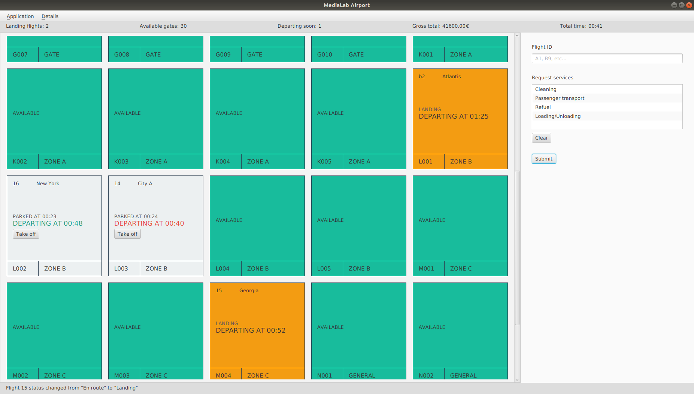

# Airport Control

A GUI application for controlling operations of a simple simulated model of an airport, like aircraft landing and departure monitoring, gate management and data reporting.

Built for the semester project of 2019-2020 ECE NTUA's undergraduate course [Multimedia Technology](https://www.ece.ntua.gr/gr/undergraduate/courses/3297) and graded with perfect score.

## Developers
* [@tdiam](https://github.com/tdiam)

## Technology
The application is built with the JavaFX 11 framework and uses Gradle as a build system.

Bonus features in terms of the software architecture:
* Use of FXML/CSS to draw on the benefits of declarative programming when building a UI.
* Universal use of resource bundles instead of raw strings, for better maintenance.
* Extensive use of JavaFX properties and observables to achieve reactivity.

## Screenshots
### Main window

### Popup window with flight details

